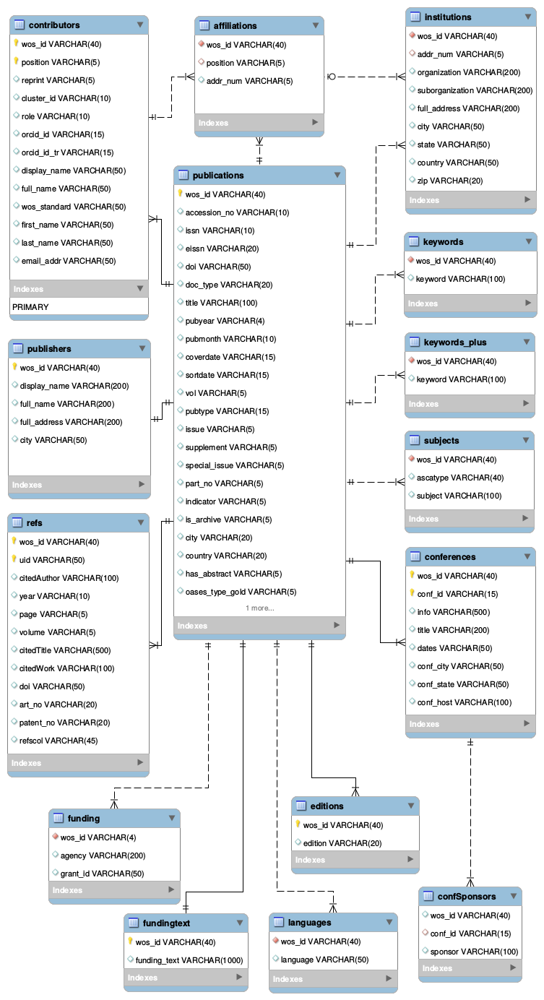

Web Of Science (WoS)
====================

The Knowledge Lab has licensed the Thomson Reuters' Web Of Science XML data for access to lab members as well as collaborators within the `MetaKnowlege network <http://www.knowledgelab.org/people/researchers/>`_. We maintain the raw XML data as well as a curated relational MySQL compatible database for different modes of analyses.

Storage bucket
--------------

The data is currently stored on two systems. The raw xmls are on S3 :

1. Complete dataset on S3 Storage : s3://klab-webofscience
2. Sample dataset on S3 Storage   : s3://klab-webofscience-sample
   
The parsed relational data is hosted on 2 RDS servers.

1. AWS Mysql compatible database  : wos.cluster-cvirc91pe37a.us-east-1.rds.amazonaws.com
2. Updated MySQL database         : wos2.cvirc91pe37a.us-east-1.rds.amazonaws.com

Schema
------

The schema for the updates MySQL database :

Permissions
-----------

The data is secured within the Cloud Kotta secure data enclave and is only accessible from within the network. For access privileges please contact the :ref:`ref_admins` for access.

.. note::
   Even derivatives from this dataset could be considered sensitive. So users are adviced to confirm with the :ref:`ref_admins` before publishing jobs that have derivatives in the output set.

Processed intermediates
-----------------------

None that are public.

Example
-------

Here are some jobs that use the the Web of Science datasets:

1. `Article Influence <https://turingcompute.net/jobs/0872b9d1-38cb-413c-a5d3-8a9a9a2de818>`_
2. `Compute Eigenfactor <https://turingcompute.net/jobs/0e860e0a-c68c-4c76-822d-a79c06c0c466>`_
3. `WoS Schema dump <https://turingcompute.net/jobs/26648db6-d073-46ef-aa03-2e0bd05e57b4>`_
